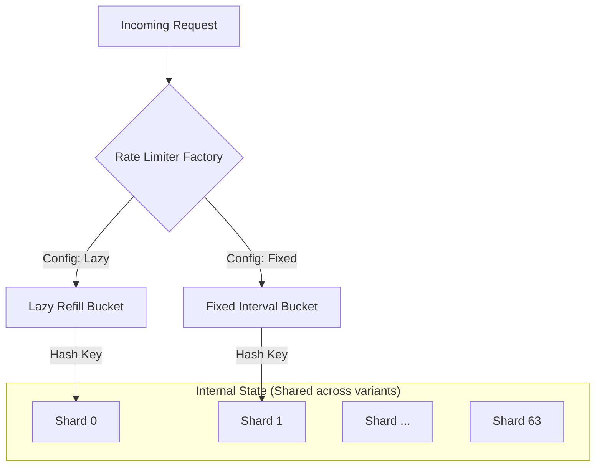

# Token Bucket Rate Limiter

A production-ready, high-precision rate limiting system implemented in Go, featuring multiple refill strategies and optimized for high-concurrency environments.

---

## 🏗️ High-Level Design (HLD)

### Architecture Overview
The system is designed as a modular library that can be plugged into any HTTP/gRPC middleware. It uses a **Shard-based Concurrency Model** to minimize lock contention and maximize throughput.



### Key Components
1.  **RateLimiter Interface**: Defines the contract (`Allow`, `Close`) ensuring that different algorithms can be swapped without changing the business logic.
2.  **Sharding Engine**: Distributes clients across 64 independent shards using `xxhash`. This allows 64 concurrent requests to be processed simultaneously as long as they hit different shards.
3.  **Factory Pattern**: Dynamically initializes the appropriate rate limiter based on environment configurations (`RATE_LIMIT_ALGO`).

---

## 🛠️ Low-Level Design (LLD)

### 1. Shared Base (`tbBase`)
Both implementations inherit from a base structure that manages:
- **Shard Lookup**: `hash(key) % shardCount`.
- **Client Lifecycle**: Lazy initialization of client buckets upon the first request.
- **Thread Safety**: Mutex-per-shard to ensure atomicity.

### 2. Lazy Refill Strategy (`tblr`)
**Philosophy**: "Refill only when asked."
- **Logic**: When a request arrives, the system calculates how many tokens should have been added since the last request using the formula:
  `tokensToAdd = (currentTime - lastAccess) * refillRate / refillWindow`
- **Pros**: Extremely high precision. Minimal background CPU (only for periodic eviction).
- **Cons**: Refill logic runs on the request path (though it's very fast math).
- **Background Task**: Spawns one goroutine per shard to periodically evict inactive clients.

### 3. Fixed Interval Strategy (`tbfc`)
**Philosophy**: "Predictable pulses."
- **Logic**: Spawns 64 background goroutines (one per shard). Every `refillWindow`, the goroutine wakes up and adds `refillRate` tokens to all active clients in that shard.
- **Pros**: Predictable refill behavior, easy to reason about for large windows (e.g., 1000 requests per hour).
- **Cons**: Consumes small amount of background CPU even when idle.

### 4. Memory Management (Eviction)
To prevent memory leaks from one-time "hit-and-run" clients, the system implements an **Idle Eviction Policy**:
- If a client's bucket is full AND it hasn't been accessed for `2 * refillWindow`, it is purged from the map.
- **Lazy Refill Implementation**: The eviction worker performs a "lazy refill calculation" during the scan to check if a bucket has refilled to its maximum capacity before purging.

---

## 📖 README & Usage

### Configuration (Environment Variables)
The system is configured via environment variables, making it perfect for Docker/Kubernetes environments.

| Variable | Default | Description |
|----------|---------|-------------|
| `RATE_LIMIT_ALGO` | `token_bucket_lazy_refill` | Algorithm to use (`token_bucket_lazy_refill` or `token_bucket_fixed_interval`) |
| `REFILL_RATE` | `3` | Number of tokens added per window |
| `REFILL_WINDOW` | `seconds` | Window duration unit (`seconds`, `minutes`, `hours`) |
| `MAX_TOKEN_LIMIT` | `100` | Maximum burst capacity of the bucket |
| `SHARD_COUNT` | `64` | Number of shards (must be a power of 2) |

### Code Integration

```go
// 1. Initialize from config
rl, err := ratelimit.NewRateLimiter(ctx, app.Config)

// 2. Use in Middleware / Handler
res, err := rl.Allow(ctx, ratelimit.RateLimitRequest{
    Key: "user-123",
    Cost: 1,
})

if !res.Allowed {
    // Return 429 Too Many Requests
    // res.RetryAfter tells the client exactly how long to wait
}
```

### API Response Metadata
The `RateLimitResult` provides standard metadata to help clients implement exponential backoff or wait-and-retry:
- `Remaining`: Tokens left in the bucket.
- `RetryAfter`: Duration to wait before the next token is available.
- `FullAt`: Timestamp when the bucket will reach maximum capacity.
